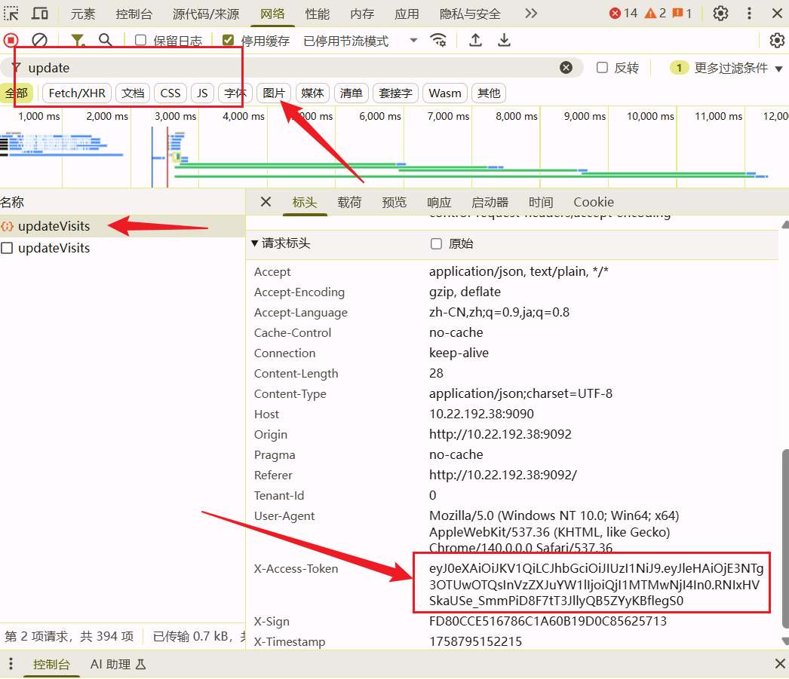

# 实验室安全教育脚本

**Script by MapleCake NJUPT2025管院新生**  
**QQ号：292441165**

该脚本已基本成型，出问题请参考重要说明。

需安装requests库 

pip install requests

如果有擅长python，JavaScript，爬虫的同学，欢迎联系我完善它。

## 版本信息

- **版本号**: v0.41 
  - 已添加材料学院11章节课程
  - 多线程已添加提高速度（可以让你邮服务器更快的崩溃啦）
  - 修复所有课程都分类为7章节的bug
  - 修复材料学院11章节少2章的bug

- **计划中**: v0.5提高检验错误机制

## ⚠️ 重要说明

本脚本只可完成课程学习和课程答题，考试仍需自行手动完成

若遇到脚本报错闪退，请换个时间重试（大部分原因是因为你邮服务器会宕机，尤其是晚上）

若三次在白天不同时段重试仍有问题，请报告给我QQ:292441165

本脚本尚不完善，需要您按以下操作帮助登录：

## 使用步骤

1. **登录账户**
   - 请校内同学从 [http://10.22.192.38:9092/](http://10.22.192.38:9092/) 登录自己的用户
   - 校外同学自行寻找实验室安全教育登录网址

2. **选择课程**
   - 任意选择一个课程打开

3. **打开开发者工具**
   - Chrome/Edge浏览器用户请右键选择检查后，再选择网络

4. **过滤请求**
   - 在页面左上角的过滤栏里输入 `updatevisits`（是左上角，不是下面的过滤框）

5. **刷新页面**
   - 刷新页面，现在你可以看到网页多了两个包

6. **复制Token**
   - 选择类型为xhr的包，在请求标头里复制 `x-access-token` 的数据，并粘贴在本程序中
   - 

---

*注：此README文件为脚本使用说明，脚本功能仍在完善中*